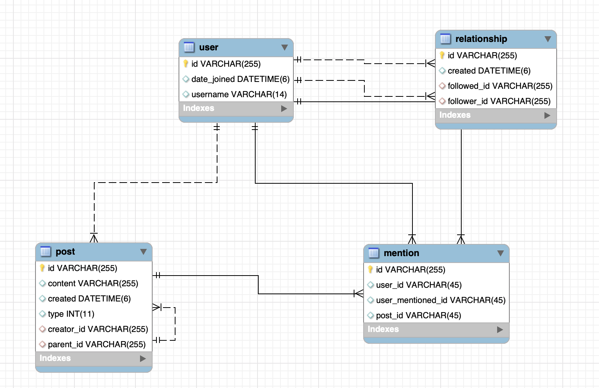

# Posterr

## Sections
 - [Stack](#Stack)
 - [How to run](#How-to-run)
 - [Features](#Features) 
 - [Planning](#Planning)
 - [Critique](#Critique)

#### Stack
 - Java 11
 - H2
 - SpringBoot
 - Gradle
 - hateoas
 - REST API
 
 **NOTES:**
 1. This application uses H2 as database, just for demonstration.
 2. This application does not create, delete, list or update users. In case needed a user id, please use:
  
    `userId = 891c10b7-267d-447e-9325-43343868e07f` 
 
#### How to run
To run the application on the local machine, if is the first time execute the following command:

	$ ./gradlew clean build bootRun

for the second time and further execute the following command:

    $ ./gradlew bootRun
    
**Note:** To run tests execute the following command:
    
    $ ./gradlew clean build test
 
#### Features

-  Fetch posts
    1. Fetch all posts from all users including reposts and quote posts. Limit 10 posts per request.
        
        Payload:        
        ```
        $ curl --location --request GET 'http://localhost:8080/posterr/api/v1/post/from-all?page=0&size=10' \
        --header 'Content-Type: application/json'
        ```
        Response:
        ```
        {
            "_embedded": {
                "postResponseList": [
                    {
                        "postId": "6c8be7f6-15ef-4d8d-9214-b21d6fb9c8fe",
                        "creator": {
                            "id": "891c10b7-267d-447e-9325-43343868e07f",
                            "userName": "username"
                        },
                        "content": "Content 29",
                        "type": "ORIGINAL",
                        "created": "2022-03-23T02:23:00.670718",
                        "_links": {
                            "self": {
                                "href": "http://localhost:8080/posterr/api/v1/post/6c8be7f6-15ef-4d8d-9214-b21d6fb9c8fe"
                            }
                        }
                    },
                    .
                    .
                    .
                ]
            },
            "_links": {
                "first": {
                    "href": "http://localhost:8080/posterr/api/v1/post/from-all?page=0&size=10"
                },
                "self": {
                    "href": "http://localhost:8080/posterr/api/v1/post/from-all?page=0&size=10"
                },
                "next": {
                    "href": "http://localhost:8080/posterr/api/v1/post/from-all?page=1&size=10"
                },
                "last": {
                    "href": "http://localhost:8080/posterr/api/v1/post/from-all?page=2&size=10"
                }
            },
            "page": {
                "size": 10,
                "totalElements": 30,
                "totalPages": 3,
                "number": 0
            }
        }
       ```
    2. Fetch all posts from a specific user including reposts and quote posts. Limit 10 posts per request.
        
        Payload:
        ```
        $ curl --location --request GET 'localhost:8080/posterr/api/v1/post/from-user?userId=891c10b7-267d-447e-9325-43343868e07f&page=0&size=5' \
          --header 'Content-Type: application/json'
        ```
        Response:
        ```
        {
            "_embedded": {
                "postResponseList": [
                    {
                        "postId": "6c8be7f6-15ef-4d8d-9214-b21d6fb9c8fe",
                        "creator": {
                            "id": "891c10b7-267d-447e-9325-43343868e07f",
                            "userName": "username"
                        },
                        "content": "Content 29",
                        "type": "ORIGINAL",
                        "created": "2022-03-23T02:23:00.670718",
                        "_links": {
                            "self": {
                                "href": "http://localhost:8080/posterr/api/v1/post/6c8be7f6-15ef-4d8d-9214-b21d6fb9c8fe"
                            }
                        }
                    },
                    .
                    .
                    .
        
                ]
            },
            "_links": {
                "first": {
                    "href": "http://localhost:8080/posterr/api/v1/post/from-user?userId=891c10b7-267d-447e-9325-43343868e07f&page=0&size=5"
                },
                "self": {
                    "href": "http://localhost:8080/posterr/api/v1/post/from-user?userId=891c10b7-267d-447e-9325-43343868e07f&page=0&size=5"
                },
                "next": {
                    "href": "http://localhost:8080/posterr/api/v1/post/from-user?userId=891c10b7-267d-447e-9325-43343868e07f&page=1&size=5"
                },
                "last": {
                    "href": "http://localhost:8080/posterr/api/v1/post/from-user?userId=891c10b7-267d-447e-9325-43343868e07f&page=5&size=5"
                }
            },
            "page": {
                "size": 5,
                "totalElements": 30,
                "totalPages": 6,
                "number": 0
            }
        }
        ```
    3. Fetch all posts from followings including reposts and quote posts. Limit 10 posts per request.
        
        Payload:
        ```
        $ curl --location --request GET 'localhost:8080/posterr/api/v1/post/from-user-home"?userId=891c10b7-267d-447e-9325-43343868e07f&page=0&size=5' \
        --header 'Content-Type: application/json'
        ```
        Response:
        ```
        {
          "_embedded": {
              "postResponseList": [
                  {
                      "postId": "6c8be7f6-15ef-4d8d-9214-b21d6fb9c8fe",
                      "creator": {
                          "id": "891c10b7-267d-447e-9325-43343868e07f",
                          "userName": "username"
                      },
                      "content": "Content 29",
                      "type": "ORIGINAL",
                      "created": "2022-03-23T02:23:00.670718",
                      "_links": {
                          "self": {
                              "href": "http://localhost:8080/posterr/api/v1/post/6c8be7f6-15ef-4d8d-9214-b21d6fb9c8fe"
                          }
                      }
                  },
                  .
                  .
                  .
      
              ]
          },
          "_links": {
              "first": {
                  "href": "http://localhost:8080/posterr/api/v1/post/from-user?userId=891c10b7-267d-447e-9325-43343868e07f&page=0&size=5"
              },
              "self": {
                  "href": "http://localhost:8080/posterr/api/v1/post/from-user?userId=891c10b7-267d-447e-9325-43343868e07f&page=0&size=5"
              },
              "next": {
                  "href": "http://localhost:8080/posterr/api/v1/post/from-user?userId=891c10b7-267d-447e-9325-43343868e07f&page=1&size=5"
              },
              "last": {
                  "href": "http://localhost:8080/posterr/api/v1/post/from-user?userId=891c10b7-267d-447e-9325-43343868e07f&page=5&size=5"
              }
          },
          "page": {
              "size": 5,
              "totalElements": 30,
              "totalPages": 6,
              "number": 0
          }
        }
        ```
-  Write a post [Original, Repost, Quoted post]
    1. Create a new post. The content limit for each post is 777 characters nad each user can post only 5 messages per day.
    
       Payload:
       ```
        $ curl --location --request POST 'localhost:8080/posterr/api/v1/post' \
        --header 'Content-Type: application/json' \
        --data-raw '{
            "userId":"891c10b7-267d-447e-9325-43343868e07f",
            "content":"It is just an example of content!",
            "type":"REPOST",
            "parentId":"88c22411-1c98-4322-a20a-3a014d657ce2"
        }'
       ```  
       Response:
       ```
        {
            "postId": "19af159a-464f-4d93-b0c9-37b241212dfa",
            "creator": {
                "id": "891c10b7-267d-447e-9325-43343868e07f",
                "userName": "username"
            },
            "content": "It is just an example of content!",
            "type": "REPOST",
            "created": "2022-03-24T00:58:49.884334",
            "_links": {
                "self": {
                    "href": "http://localhost:8080/posterr/api/v1/post/19af159a-464f-4d93-b0c9-37b241212dfa"
                }
            }
        }
       ``` 
-  Follow/unfollow users
    1. Endpoint to follow other users. Users cannot follow themselves.
    
    Payload:
    ```
    $ curl --location --request POST 'localhost:8080/posterr/api/v1/relationship' \
    --header 'Content-Type: application/json' \
    --data-raw '{
        "followerUserId":"891c10b7-267d-447e-9325-43343868e07f",
        "followedUserId":"a0b791c1-q23q-447e-0000-43343868e07f"
    }'
    ```
    Response:
    ```
    {
     true
    }
    ```
    
    2. Endpoint to unfollow other users.
    
    Payload:
    ```
    $ curl --location --request DELETE 'localhost:8080/posterr/api/v1/relationship/891c10b7-267d-447e-9325-43343868e07f/unfollow/a0b791c1-q23q-447e-0000-43343868e07f' \
      --header 'Content-Type: application/json' \
      --data-raw '{
          "followerUserId":"891c10b7-267d-447e-9325-43343868e07f",
          "followedUserId":"a0b791c1-q23q-447e-0000-43343868e07f"
      }'
    ```
    Response:
    ```
    No content
    ``` 
-  Fetch user info
    1. Endpoint to fetch info from a user. User id, username and joined date.
    
    Payload
    ```
    $ curl --location --request GET 'localhost:8080/posterr/api/v1/user/891c10b7-267d-447e-9325-43343868e07f/data' \
      --header 'Content-Type: application/json'
    ```   
    Response:
    ```
    {
        "id": "891c10b7-267d-447e-9325-43343868e07f",
        "userName": "John",
        "joinedDate": "March 24, 2022",
        "_links": {
            "self": {
                "href": "http://localhost:8080/posterr/api/v1/user/891c10b7-267d-447e-9325-43343868e07f/data"
            }
        }
    }
    ``` 
   
   2. Endpoint to return information about the number of followers and following from a user.
   
   Payload:
   ```
   $ curl --location --request GET 'localhost:8080/posterr/api/v1/relationship/891c10b7-267d-447e-9325-43343868e07f/data' \
     --header 'Content-Type: application/json'
   ```
   
   Response:
   ```
   {
       "userId": "891c10b7-267d-447e-9325-43343868e07f",
       "followers": 1,
       "followeds": 1,
       "_links": {
           "self": {
               "href": "http://localhost:8080/posterr/api/v1/relationship/891c10b7-267d-447e-9325-43343868e07f/data"
           }
       }
   }
   ```
-  Endpoint to check if a user follow another user.

    Payload:
    ```
    $ curl --location --request GET 'localhost:8080/posterr/api/v1/relationship/891c10b7-267d-447e-9325-43343868e07f/following/Acftggg-267d-0c4r-3462-868e07f43343' \
    --header 'Content-Type: application/json'
    ```
   
   Response:
   ```
   {
    true
   }
   ```
   


#### Planning
The Product Manager wants to implement a new feature called "reply-to-post" (it's a lot like Twitter's These are regular posts that use "@ mentioning" at the beginning to indicate that it is a reply directly to a post. Reply posts should only be shown in a new, secondary feed on the user profile called "Posts and Replies" where all original posts and reply posts are shown. They should not be shown in the homepage feed.
What you need to do:
- Write down questions you have for the Product Manager about implementation.
- Write about how you would solve this problem in as much detail as possible. Write about all of the changes to database/front-end/api/etc that you expect. You should write down any assumptions you are making from any questions for the Product Manager that you previously mentioned.


**Questions:**
- Should I as a user be able to see all Posts that another user has been mentioned?
- What kind of user should be able to be mentioned by another user? Only the following users or all users?
- How many users can be mentioned in a post?
- Should the mentioned user receive a notification to make him aware?
- What user has to do to tag another user?


**Assumptions**:
- The "Posts and Replies" is a secondary feed on the “User profile” screen, with that all users that are able to see the “User profile” feed also are able to see the “Post and Replies”.
- The user only is able to mention the following users.
- No, the mentioned user has to navigate to the "Posts and Replies" and check the mentions.
- After adding “@” the app will display a list of possible usernames, if user type more characters they have to filter the possible usernames. Limit 5 usernames, query type “XXX%” order by asc.

Changes:
- Create a new table “mention” to store data about: who was mentioned, who made the mention, and what post. See diagram.


- Create an endpoint to fetch all posts where a user was mentioned(paginated, limit 5 items per page) by another.
- Change the endpoint to create posts, adding the attribute "mentionedUser" in the payload. When there is
a "mentionedUSer" in the payload the application has to create the "mention" object and
persis it on the database.   
- Create an endpoint to return a list of items(username, user_id) by the first character of username, limit 5 items ordered by the username sorted in ascending order.


#### Critique
In any project, it is always a challenge to get the code perfectly how you'd want it. Here is what you need to do for this section:

- Reflect on this project, and write what you would improve if you had more time.
- Write about scaling. If this project were to grow and have many users and posts, which parts do you think would fail first? In a real-life situation, what steps would you take to scale this product? What other types of technology and infrastructure might you need to use?

 


	
